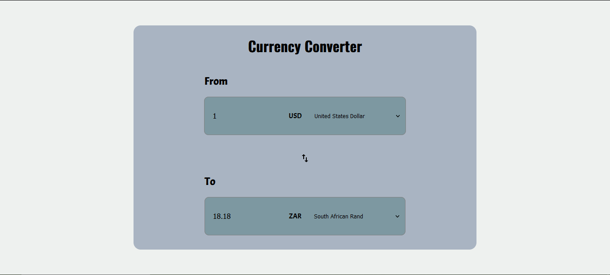

# Project Title

React Currency Converter App

## Demo Link:

Access my site at https://59mrrobot.github.io/currency-converter/

## About The App:

I have built a currency that utilizes an API (https://exchangeratesapi.io/).

## Screenshots:

## Technologies:

- React
- Typescript
- HTML
- SCSS
- Redux
- Material-UI

## Setup:

- Download or clone the repository.
- Install by running `npm install`.
- Start the server by running `npm start`.
- Visit the app at `http://localhost:3000/`.
